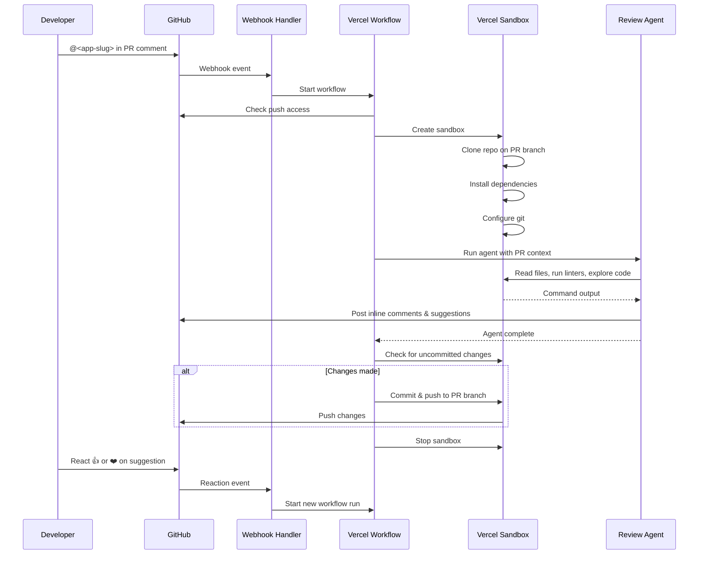

# OpenReview

An open-source, self-hosted AI code review bot. Deploy to Vercel, connect a GitHub App, and get on-demand PR reviews powered by your configured model provider.

> **Beta**: OpenReview is currently in beta. It was built as an internal project to help the Vercel team test their technologies together. Expect rough edges and breaking changes.

[](https://vercel.com/new/clone?demo-description=An+open-source%2C+self-hosted+AI+code+review+bot.+Deploy+to+Vercel%2C+connect+a+GitHub+App%2C+and+get+automated+PR+reviews+powered+by+your+configured+model+provider.&demo-image=https%3A%2F%2Fopenreview.labs.vercel.dev%2Fopengraph-image.png&demo-title=openreview.labs.vercel.dev&demo-url=https%3A%2F%2Fopenreview.labs.vercel.dev%2F&from=templates&project-name=OpenReview&repository-name=openreview&repository-url=https%3A%2F%2Fgithub.com%2Fvercel-labs%2Fopenreview&env=GITHUB_APP_ID%2CGITHUB_APP_INSTALLATION_ID%2CGITHUB_APP_PRIVATE_KEY%2CGITHUB_APP_WEBHOOK_SECRET%2COPENREVIEW_MODEL%2COPENROUTER_API_KEY%2CANTHROPIC_API_KEY&products=%5B%7B%22integrationSlug%22%3A%22upstash%22%2C%22productSlug%22%3A%22upstash-kv%22%2C%22protocol%22%3A%22storage%22%2C%22type%22%3A%22integration%22%7D%5D&skippable-integrations=0)

## Features

- **On-demand reviews** — Mention the app in any PR comment to trigger a review. The handle is your GitHub App's slug, e.g. `@openreview-property-search`. Powered by [Chat SDK](https://chat-sdk.dev)
- **Automatic frontier quality gate** — An optional bounded, deterministic-quality gate that judges agent-written PRs with at most two frontier-model calls per review cycle
- **Sandboxed execution** — Runs in an isolated [Vercel Sandbox](https://vercel.com/docs/sandbox) with full repo access, including the ability to run linters, formatters, and tests
- **Inline suggestions** — Posts line-level comments with GitHub suggestion blocks for one-click fixes
- **Code changes** — Can directly fix formatting, lint errors, and simple bugs, then commit and push to your PR branch
- **Reactions** — React with 👍 or ❤️ to approve suggestions, or 👎 or 😕 to skip
- **Durable workflows** — Built on [Vercel Workflow](https://vercel.com/docs/workflow) for reliable, resumable execution
- **Extensible skills** — Ships with built-in review [skills](https://skills.sh) and supports custom skills via `.agents/skills/`
- **Configurable models** — Uses your configured provider and model via the [AI SDK](https://sdk.vercel.ai)
- **Simple route handler** — Easily define route handlers using [Next.js Route Handlers](https://nextjs.org/docs/app/building-your-application/routing/route-handlers) for custom API endpoints and webhooks

## How it works



1. Mention the app's slug in a PR comment, e.g. `@openreview-property-search` (optionally with specific instructions)
2. OpenReview spins up a sandboxed environment and clones the repo on the PR branch
3. A configured AI agent reviews the diff, explores the codebase, and runs project tooling
4. The agent posts its findings as PR comments with inline suggestions
5. If changes are made (formatting fixes, lint fixes, etc.), they're committed and pushed to the branch
6. The sandbox is cleaned up

## Setup

### 1. Deploy to Vercel

Click the button above or clone this repo and deploy it to your Vercel account.

### 2. Create a GitHub App

Create a new [GitHub App](https://github.com/settings/apps/new) with the following configuration:

**Webhook URL**: `https://your-deployment.vercel.app/api/webhooks`

**Repository permissions**:

- Checks: Read & write (automatic frontier quality gate)
- Contents: Read & write
- Issues: Read & write
- Pull requests: Read & write
- Metadata: Read-only

**Subscribe to events**:

- Check run
- Issue comment
- Pull request
- Pull request review comment

Generate a private key and webhook secret, then note your App ID and Installation ID.

### 3. Configure environment variables

Add the following environment variables to your Vercel project:

| Variable                      | Description                                                                                  |
| ----------------------------- | -------------------------------------------------------------------------------------------- |
| `OPENREVIEW_MODEL`            | Model ID to use for reviews. Defaults to `anthropic/claude-sonnet-4.6`                       |
| `OPENROUTER_API_KEY`          | OpenRouter API key. If set, OpenReview uses OpenRouter for the configured `OPENREVIEW_MODEL` |
| `ANTHROPIC_API_KEY`           | Anthropic API key used as a fallback when `OPENROUTER_API_KEY` is not set                    |
| `GITHUB_APP_ID`               | The ID of your GitHub App                                                                    |
| `GITHUB_APP_INSTALLATION_ID`  | The installation ID for your repository                                                      |
| `GITHUB_APP_PRIVATE_KEY`      | The private key generated for your GitHub App (with `\n` for newlines)                       |
| `GITHUB_APP_WEBHOOK_SECRET`   | The webhook secret you configured                                                            |
| `REDIS_URL`                   | Redis URL for durable state. **Required in production**: without it the gate fails closed    |
| `FRONTIER_ENABLED`            | (Optional) Set to `false` to disable the automatic frontier quality gate. Default `true`     |
| `FRONTIER_MODEL`              | (Optional) Frontier judge model. Default `z-ai/glm-5.3`                                      |
| `FRONTIER_DAILY_BUDGET_USD`   | (Optional) Daily frontier spend ceiling. Default `5`                                         |
| `FRONTIER_MONTHLY_BUDGET_USD` | (Optional) Monthly frontier spend ceiling. Default `50`                                      |
| `FRONTIER_REQUIRED_CHECKS`    | (Optional) Comma-separated required checks, used instead of branch protection                |

Recommended Vercel setup:

```bash
OPENREVIEW_MODEL=anthropic/claude-sonnet-4.6
OPENROUTER_API_KEY=your-openrouter-api-key
```

Example `OPENREVIEW_MODEL` values:

- `anthropic/claude-sonnet-4.6`
- `openai/gpt-4o`
- `z-ai/glm-5`

Fallback behavior:

- If `OPENROUTER_API_KEY` is present, OpenReview uses OpenRouter.
- Otherwise, if `ANTHROPIC_API_KEY` is present, OpenReview keeps the Anthropic path working.
- If neither key is configured, the agent fails fast with a clear configuration error.
- When using the Anthropic fallback path, `OPENREVIEW_MODEL` must be an `anthropic/*` model.

### 4. Install the GitHub App

Install the GitHub App on the repositories you want OpenReview to monitor. Once installed, mention the app's slug in any PR comment to trigger a review — the mention must match the App name exactly (`@openreview-property-search` for this deployment), because the adapter matches on the App slug, not on the repository name.

## Automatic frontier quality gate

Separate from the manual agent, the frontier quality gate automatically judges
agent-written pull requests and reports a single stable `frontier-quality`
check. It waits for your configured required CI before spending anything, skips
low-value PRs (docs, assets, lockfiles) for free, and is bounded to **two
frontier calls per review cycle**:

1. PR opened/updated → required CI green → one frontier review
2. Findings are surfaced on the check and as a PR comment; the originating agent
   fixes and pushes (any number of repair pushes costs $0)
3. Add the `frontier-ready-final` label → one delta-only review → PASS or BLOCK
4. After a BLOCK, only the explicit `frontier-new-cycle` label can spend again

Configure it per repository with `.github/frontier-review.yml`:

```yaml
frontier:
  enabled: true
  threshold: 5
  always_review: ["src/agents/**", "benchmarks/**"]
  never_review: ["generated/**"]
```

Set `FRONTIER_DAILY_BUDGET_USD` and `FRONTIER_MONTHLY_BUDGET_USD` to bound
spend. Full design, signals, caps, labels and acceptance tests:
[docs/frontier-quality-gate.md](docs/frontier-quality-gate.md).

## Usage

**Trigger a review**: Comment the app's mention handle on any PR. The handle is the GitHub App slug — `@openreview-property-search` on this deployment. A bare `@openreview` will not match, because the adapter matches the configured App name exactly. You can include specific instructions:

```
@openreview-property-search check for security vulnerabilities
@openreview-property-search run the linter and fix any issues
@openreview-property-search explain how the authentication flow works
```

**Reactions**: React with 👍 or ❤️ on an OpenReview comment to approve and apply its suggestions. React with 👎 or 😕 to skip.

## Skills

OpenReview uses a progressive skill system — the agent only loads specialized instructions when relevant, keeping context focused and reviews thorough. Skills are discovered from `.agents/skills/` at runtime.

### Built-in skills

| Skill                         | Description                                                                           |
| ----------------------------- | ------------------------------------------------------------------------------------- |
| `next-best-practices`         | File conventions, RSC boundaries, data patterns, async APIs, metadata, error handling |
| `next-cache-components`       | PPR, `use cache` directive, `cacheLife`, `cacheTag`, `updateTag`                      |
| `next-upgrade`                | Upgrade Next.js following official migration guides and codemods                      |
| `vercel-composition-patterns` | React composition patterns that scale for component refactoring                       |
| `vercel-react-best-practices` | React and Next.js performance optimization guidelines                                 |
| `vercel-react-native-skills`  | React Native and Expo best practices for performant mobile apps                       |
| `web-design-guidelines`       | Review UI code for Web Interface Guidelines and accessibility compliance              |

### Adding custom skills

Create a folder in `.agents/skills/` with a `SKILL.md` file containing YAML frontmatter:

```
.agents/skills/
└── my-custom-skill/
    └── SKILL.md
```

```markdown
---
name: my-custom-skill
description: When to use this skill — the agent reads this to decide whether to load it.
---

# My Custom Skill

Your specialized review instructions here...
```

The agent sees only skill names and descriptions in its system prompt. When a request matches a skill, it calls `loadSkill` to get the full instructions — keeping the context window clean.

## Tech stack

- [Next.js](https://nextjs.org) — App framework
- [Vercel Workflow](https://vercel.com/docs/workflow) — Durable execution
- [Vercel Sandbox](https://vercel.com/docs/sandbox) — Isolated code execution
- [AI SDK](https://sdk.vercel.ai) — AI model integration
- [Chat SDK](https://www.npmjs.com/package/chat) — GitHub webhook handling
- [Octokit](https://github.com/octokit/octokit.js) — GitHub API client

## Development

```bash
bun install
bun dev
```

## License

MIT
